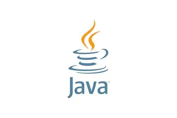

  
  &nbsp;&nbsp;
  

# ☕ Cours Java — ISI

> **Formateur :** Robert | **Établissement :** ISI (Institut Supérieur d'Informatique)
> **Niveau :** Licence 2

Ce dépôt couvre le langage Java : des bases procédurales jusqu'à la Programmation Orientée Objet.

---

## 📚 Supports de cours

| # | Chapitre | Lien |
|---|----------|------|
| 1 | Introduction à Java | [📄 cours/1-introJava.pdf](cours/1-introJava.pdf) |
| 2 | Variables, constantes & types | [📄 cours/2-var_cont_type_JAVA.pdf](cours/2-var_cont_type_JAVA.pdf) |
| 3 | Structures de contrôle | [📄 cours/3-Struc_cont.pdf](cours/3-Struc_cont.pdf) |
| 4 | Les tableaux | [📄 cours/4-tableau_JAVA.pdf](cours/4-tableau_JAVA.pdf) |
| 5 | Chaînes de caractères | [📄 cours/5-chaine_carscJAVA.pdf](cours/5-chaine_carscJAVA.pdf) |
| 6 | Modularité Java | [📄 cours/6-modulariteJava.pdf](cours/6-modulariteJava.pdf) |
| 7 | Programmation Orientée Objet | [📄 cours/7-javaPOO.pdf](cours/7-javaPOO.pdf) |

---

## 🏋️ Exercices

| Exercice | Lien |
|----------|------|
| Série 1 | [📄 exercices/Javaserie1.pdf](exercices/Javaserie1.pdf) |
| Série bases | [📄 exercices/java_serie1.pdf](exercices/java_serie1.pdf) |
| Série tableaux | [📄 exercices/java_série_tab.pdf](exercices/java_s%C3%A9rie_tab.pdf) |
| Test procédural | [📄 exercices/javaproce_test.pdf](exercices/javaproce_test.pdf) |
| Devoir 1 — 2025 | [📄 exercices/dev12025.pdf](exercices/dev12025.pdf) |

---

## ✅ Corrections

| Correction | Lien |
|------------|------|
| Corrigé Série 1 | [📄 corrections/Javaserie1_solution.pdf](corrections/Javaserie1_solution.pdf) |

---

## 🔗 Autres cours

| Cours | Lien |
|-------|------|
| Langage C | [Cours_LangageC](https://github.com/Robsroberto/Cours_LangageC) |
| C# | [CoursCsharp](https://github.com/Robsroberto/CoursCsharp) |
